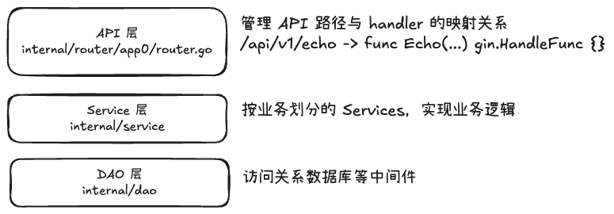

# Go example app

本项目为 Go 示例项目。

## 主要框架/库

| Framework/Lib Name | Summary        | Description |
|--------------------|----------------|-------------|
| gin                | Go 生态主流 Web 框架 |             |
| gorm               | Go 生态主流 ORM 框架 |             |
| viper              | 配置解析库          |             |
| fx                 | 依赖注入框架         |             |
| cobra              | Go 生态主流命令行框架   |             |
| ginkgo             | 集成测试框架         |             |
| gomega             | 集成测试断言库        |             |

## 工具链

本项目依赖以下工具：

| Framework/Lib Name | Summary                                                                                                                                  | Installation                                                        | |
|--------------------|------------------------------------------------------------------------------------------------------------------------------------------|---------------------------------------------------------------------|-|
| go                 | Go 编译器和开发环境                                                                                                                              | https://go.dev/doc/install                                          | |
| golangci-lint      | Go 代码 lint 工具                                                                                                                            | https://golangci-lint.run/docs/welcome/install/                     | |
| make               | GNU Make is a tool which controls the generation of executables and other non-source files of a program from the program's source files. | https://www.gnu.org/software/make/                                  | |
| kind               | 本地部署 Kubernetes 工具                                                                                                                       | https://kind.sigs.k8s.io/docs/user/quick-start/                     | |
| kubectl            | Kubernetes 命令行工具                                                                                                                         | https://kubernetes.io/zh-cn/docs/tasks/tools/install-kubectl-linux/ | |
| docker             | 容器运行时和镜像工具                                                                                                                               | https://docs.docker.com/engine/install/                             | |

## 项目结构

### 业务层次结构

项目业务逻辑主要分为三层：
- API 层：将 API 路径映射到具体的 handler。handler 层不涉及具体的业务逻辑，仅处理与 HTTP 相关逻辑后，调用 Service 层实现具体业务逻辑。
- Service 层：按业务划分 Services 模块，实现具体的业务逻辑。
- DAO 层：访问关系数据库等中间件，实现数据访问与业务逻辑的解耦。



### 如何构建项目

可以通过如下命令行构建 app0 image：

```shell
make build-app0-image
```

构建过程全程通过 Docker 构建，除 docker 外不会用到本地工具链。
这样做的优点是
1）标准化，由于构建过程不在宿主机上，避免了宿主机环境不同造成的制品差异；
2）易上手，由于不使用本地工具链，新手可以在不必准备繁多的工具链的情况下构建项目。
缺点是
1）目前不能像本地构建一样复用构建过程的缓存，构建时间可能长于本地构建。

### 如何测试项目

可以使用如下命令行测试项目：

```text
make e2e
```

该命令会构建项目产生 image；
构建名为 `ginkgo:dev` 的 image，包含测试逻辑和用例；
使用 `kind` 部署一个测试用的 Kubernetes 集群；
将项目应用和中间件部署到 Kubernetes 集群；
部署一个名为`ginkgo`的 pod，该执行测试逻辑输出测试结果。

### 如何交付项目

如果项目被部署于 Kubernetes 平台，优先考虑使用 helm 交付。

关于生成 helm 制品的部分目前未实现。


### 如何部署项目

构建项目后，产生制品 docker image。
可以使用 docker compose 或 Kubernetes 部署项目。

### 目录树
```text
.
├── .github             # github 相关配置
│ └── workflows         # 定义 github workflow
│     └── e2e.yml
├── .golangci.yml       # 定义 Go 代码规约
├── .workflow           # 定义 Gitee 流水线
├── Dockerfile          # 定义项目所用到的 Dockerfiles
├── Makefile            # 定义常用命令
├── README.MD           
├── cmd                 # 项目程序入口
│ ├── app0
│ │ └── main.go
│ └── app1
│     └── main.go
├── config              # 项目配置文件
│ ├── app0
│ │ └── config.yaml
│ └── app1
│     └── config.yaml
├── go.mod
├── go.sum
├── helm                # 存放项目制品（K8s）
├── internal            # 业务逻辑
│ ├── common            # 公共定义
│ │ ├── config.go
│ │ ├── healthz.go
│ │ ├── version.go
│ │ └── viper.go
│ ├── dao               # Data Access Object 层，即数据访问逻辑
│ ├── model             # 定义模型，即库表结构的映射以及其他的结构体
│ ├── router            # 定义 Web API 路由和 Handler
│ │ ├── app0
│ │ │ ├── context.go
│ │ │ ├── handle_xx.go  # 定义具体 API 的 Handler
│ │ │ └── router.go     # 定义 API 路由
│ │ └── app1
│ │     └── router.go
│ ├── service           # Service 层，实现具体的业务逻辑
│ └── upgrade           # 存放模型变更相关的逻辑，即 migration
├── openapi
├── pkg                 # 存放常用 interface{}、算法、库等
│ └── engine
│     └── engine.go
├── sdk                 # 访问 Web 服务的 sdk，用于 e2e 测试
│ ├── app0
│ │ └── echo.go
│ └── app1
└── test                # 测试目录
  ├── e2e               # e2e 即集成测试
  │ ├── e2e_test.go     # e2e 测试入口
  │ └── echo            # e2e 测试用例
  │     └── echo.go
  └── framework         # 测试框架，用于控制测试的生命周期，如部署组件等

```
